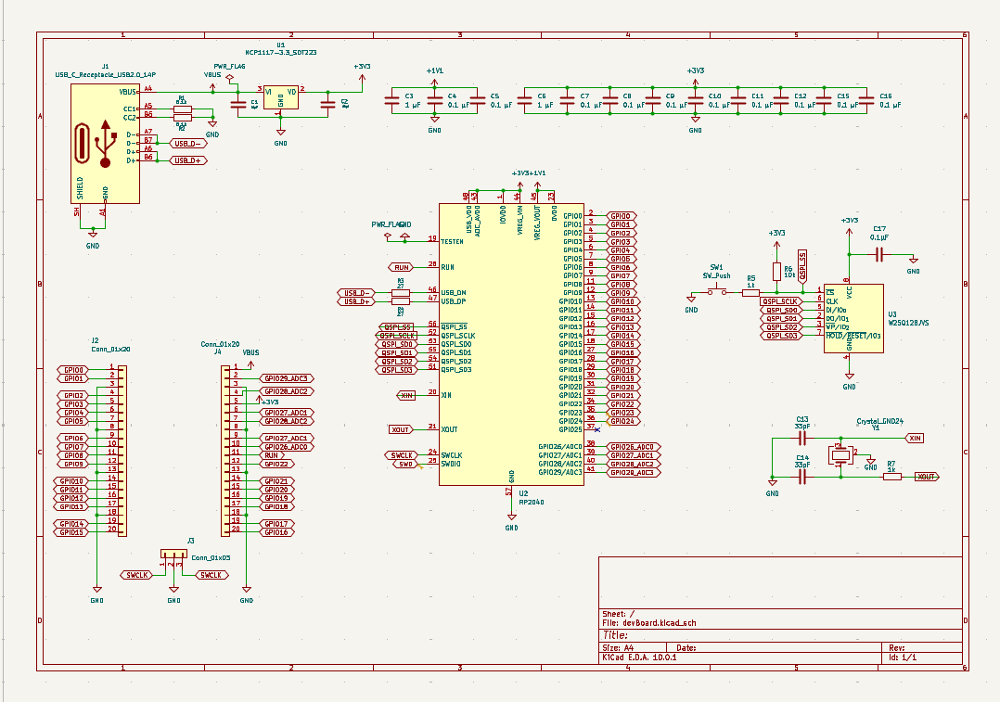
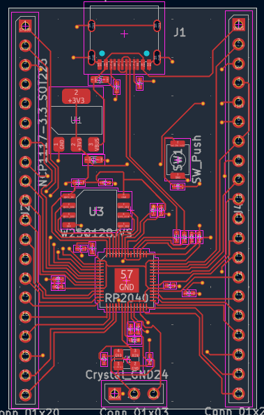
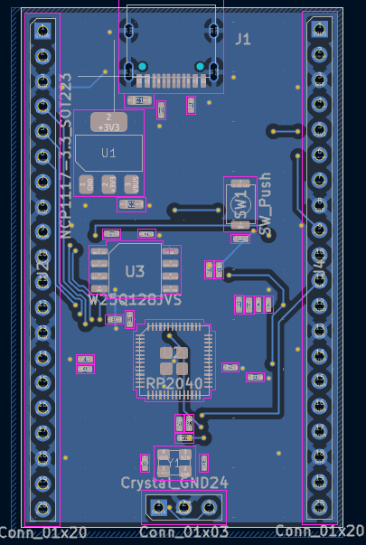
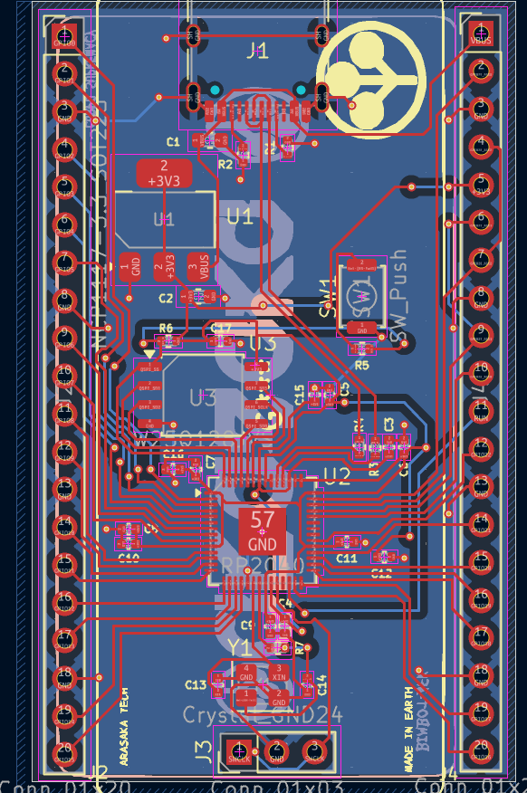
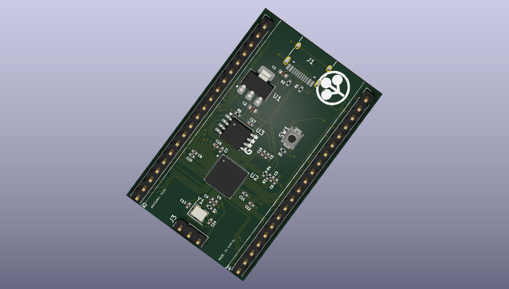
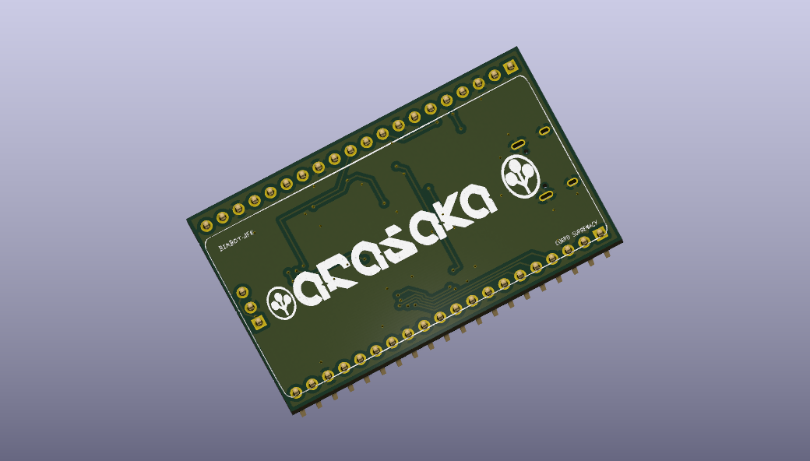

# Arasaka DevBoard

A custom development board hardware project designed in KiCad.
It has a cool design based on Arasaka from Cyberpunk 2077 >:D

## Hardware Specifications & BOM

The board is built around the RP2040 ecosystem using high-density SMD components (mostly 0402 imperial footprint).

*   **Microcontroller (MCU):** Raspberry Pi RP2040 (Dual ARM Cortex-M0+ @ 133MHz, QFN-56)
*   **Storage:** Winbond W25Q128JVSIQ (16MB SPI Flash, SOIC-8)
*   **Power Management:** onsemi NCP1117ST33T3G (3.3V LDO Linear Regulator, SOT-223)
*   **Clock / Timing:** YXC 12MHz Crystal Oscillator (SMD 3225-4P)
*   **Interfacing:** Korean Hroparts TYPE-C-31-M-12 (USB-C Receptacle, 16-pin SMD)
*   **Electromechanical:** ALPS SKRKAEE020 (Tactile Switch for BOOTSEL/RESET)
*   **Passives:** Standard 0402 and 0603 ceramic capacitors (X5R/X7R dielectrics) and thick film resistors (1% tolerance on USB data lines).
*   **Expansion:** 2.54mm pitch through-hole pin headers.

## Schematics

## Layers

### F.cu

### B.cu

### Both

### Front

### BACK

## Project Structure

- **`3D_Models/`**: Contains 3D assets (`.step`, `.glb`, `.blend`) for the board and components.
- **`Fabrication/`**: Destination folder for generated manufacturing files like Gerbers, drill files, and BOMs.
- **`Libraries/`**: Project-specific footprints and symbols (e.g., custom Arasaka assets).
- **Core Files**: The main KiCad project files (`.kicad_pro`, `.kicad_sch`, `.kicad_pcb`) are located in the root directory.

## Getting Started

To view or modify this project, you will need [KiCad](https://www.kicad.org/) (Version 6+ recommended). 

1. Clone this repository.
2. Open the `devBoard.kicad_pro` file in KiCad to load the project.
